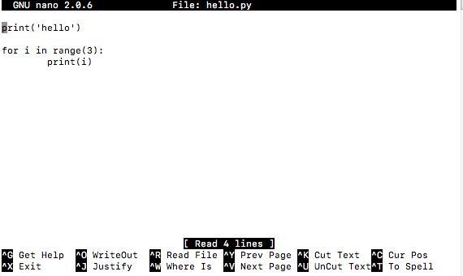

# OC informatique 2021-22

## Le Finder
Le **Finder** est un gestionnaire de fichiers dans **macOS**.
Il permet de manipuler les dossiers et de les
- créer
- afficher
- trier 

Vous pouvez créer des
- nouvelles fenêtres (ctrl+N)
- nouveaux dossiers (ctrl+maj+N)

## Dossier **home** local/réseau

Mettre vos documents sur le réseau (p******) vous permet d'y accéder depuis tous les ordinateurs du gymnase.

## Le terminal
Le **terminal** et une applications textuel qui permet de gérer et maitriser complètement la machine à l'aide de commande écrites dans une console.

Au début la console affiche sa dernière utilisation.

    Last login: Thu Aug 26 11:32:24 on console
    M507-2:~ pp77$

Ensuite est affiché
- machine (`M507-2`)
- dossier actuel (`~` home)
- utilisateur (`pp77`)
- prompt (`$`) ou invite

C'est après le prompt (`$`) que vous pouvez entrer une commande.
La commande `pwd` (print working directory) affiche le dossier actuel.    

    M507-2:~ pp77$ pwd
    /Users/pp77

## Se déplacer dans l'arborescence

La commande **cd** permet de se déplacer dans l'arborescence

    pwd (print working directory)
    cd
    cd /
    cd /bin
    cd ~
    cd ..

## Votre home directory

C'est votre dossier personnel local. Les fichiers résident en local sur cet ordinateur.

    $ cd
    $ pwd
    /Users/pp77

## Aller sur serveur

Utiliser la touche `TAB` (tabulateur) pour compléter un chemin

    cd /V (TAB)
    cd /Volumes
    cd /Volumes/p (TAB)
    cd /Voluves/pp77xir

## Dossier particuliers
Plusieurs dossiers ont des abbréviations courtes

    / (root)
    ~ (home directoery cmd+N)
    .. (parent directory)
    ../.. (grandparent)
    . (current directory)

# Créer des dossiers

La commande `mkdir` (make directory) permet de créer un dossier.

    mkdir oc
    mkdir oc/music
    
La commande `rmdir` (remove directory) permet de supprimer un dossier.

    rmdir oc

## Chemin relatif/absolue

    cd oc (relatif)
    cd /Volumes/pp77xir/oc/ (absolu)

    cd .. (relatif)
    cd /Volumes/pp77xir/ (absolu)

## Déplacer ou renommer
La commande `mv` (move) permet de déplacer (ou renommer) un fichier.

    mv game game2
    mv game2 ..
    mv video demo

## Afficher le contenue
La commande `ls` (listing) permet d'afficher le contenu d'un dossier. Par exemple ceci affiche le contenu de la racine (`/` root)

    $ ls /
    Applications		home
    Library				net
    System				opt
    Users				private
    Volumes				sbin
    bin				    usr
    cores				var

Ceci afficher le contenu du dossier `/bin`

    $ ls /bin/
    pwd		test    bash    link	rmdir
    chmod	ed		ls		sh		zsh
    cp		mv	mkdir		sleep   date

## Afficher les détails

Vous pouvez ajouter des options aux commandes. Par exemple `ls -l` affiche des détails

## Touch

La commande `touch` (toucher) permet de mettre à jour la date de modification.
Si le fichier n'existe pas, un fichier de taille 0 est créé.

    touch file_a
    touch dossier_a

## Jour et date

La commande `date` écrit la date et le temps actuel.

    $ date
    Mer 25 aoû 2021 14:09:10 CEST

La commande `cal` écrit un calendrier.

    $ cal
        Août 2021        
    Di Lu Ma Me Je Ve Sa  
    1  2  3  4  5  6  7  
    8  9 10 11 12 13 14  
    15 16 17 18 19 20 21  
    22 23 24 25 26 27 28  
    29 30 31                  

## L'éditeur nano

    nano

    # Titre
    Ceci est une ligne de text.

Etappes:
- ctr-X exit
- Y pour sauvegarder
- donner le nom demo.txt

Vérifier le fichier

    ls
    cat demo.txt

## Lancer python

La commande `python` lance l'application Python en mode console.

    $ python
    Python 2.7.16 (default, Jan 26 2020, 23:50:38) 
    [GCC 4.2.1 Compatible Apple LLVM 9.0.0 (clang-900.0.31)] on darwin
    Type "help", "copyright", "credits" or "license" for more information.
    >>> 
    
Après le prompt `>>>` vous pouvez entrer une commande.

    >>> 2 ** 8
    256
    >>> 2 ** 32
    4294967296
    >>> print('hello ' * 3)
    hello hello hello

Pour quitter Python

    >>> quit()

## Python 3

Pour lancer la version plus récente de Python, utilisez la commande `python3`

    $ python3
    Python 3.9.1 (v3.9.1:1e5d33e9b9, Dec  7 2020, 12:10:52) 
    [Clang 6.0 (clang-600.0.57)] on darwin
    Type "help", "copyright", "credits" or "license" for more information.
    >>> 

Essayez maintenant d'entrer une boucle à la console

    >>> for i in range(3):
    ...     print('hello', i)
    ... 
    hello 0
    hello 1
    hello 2

Le prompt `...` vous indique que la commande `for` n'est pas fini. La dernière ligne vide (`...`) indique la fin de la boucle et force l'exécution. 

## Créer un ficher et l'exécuter

Lancez l'éditeur nano avec un nom de fichier

    $ nano hello.py

Entrez le texte suivant

- sauvegarder avec ctrl+O (Output)
- quitter avec ctrl+X (eXit)

Ensuite executez le programme depuis la console

    $ python3 hello.py 
    hello
    0
    1
    2

